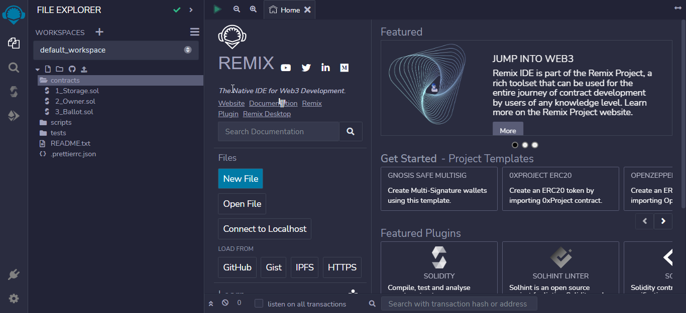
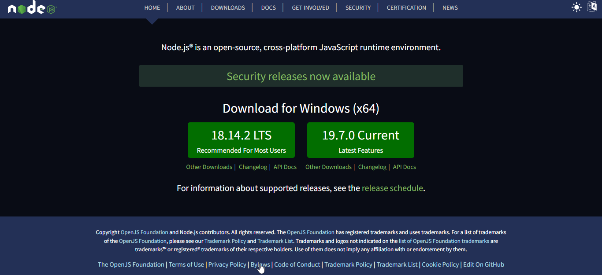
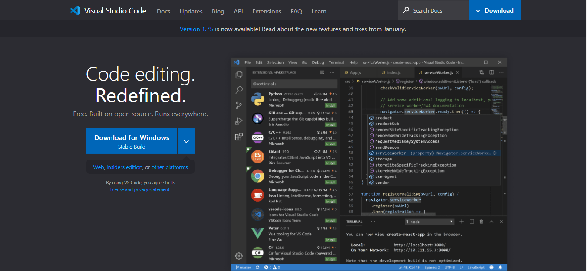

# Welcome to Day 1 📔

## Introduction to Solidity

Solidity is a high-level programming language used for writing smart contracts on the Ethereum blockchain. It was created by the Ethereum Foundation and is designed to be easy to learn and use for developers of all levels of experience.

Smart contracts are self-executing contracts with the terms of the agreement between buyer and seller being directly written into lines of code. They run on the blockchain, and allow for secure and transparent transactions without the need for intermediaries.

Solidity is the most popular programming language for writing smart contracts on Ethereum, and it offers a range of features that make it well-suited for this purpose. Some of its key features include:

Object-oriented programming (OOP) principles, such as inheritance and polymorphism
A syntax that is similar to JavaScript, making it easy for developers who are familiar with that language to get started with Solidity
Support for both structured and dynamic types, as well as user-defined types
Built-in functions for performing common tasks, such as sending and receiving ether
The ability to interact with other contracts and with the Ethereum Virtual Machine (EVM)
Learning Solidity is an essential skill for anyone interested in developing decentralized applications (Dapps) on the Ethereum blockchain. By mastering this language, you can create smart contracts for a variety of use cases, such as token creation, supply chain management, and more.

### Here are some prerequisites you should have before starting this repository:

- Basic understanding of blockchain technology: It's important to have a basic understanding of blockchain technology, how it works, and its applications. This includes concepts like decentralized ledgers, cryptography, and consensus algorithms.

- Familiarity with Ethereum: You should also have some familiarity with the Ethereum platform, including its purpose, history, and architecture. This includes understanding what a smart contract is, how it works, and its benefits.

- Some programming experience: While Solidity is designed to be easy to learn, it's still a programming language, and you'll need some basic programming experience to be able to follow along with the lessons. If you're new to programming, it's recommended that you start with a beginner-level language like Python before moving on to Solidity.


## Setup
To write and test Solidity code, you'll need a development environment like Remix or a local setup using tools like Truffle/Hardhat and Ganache. We'll be using Remix for this repository, but feel free to use the environment that you're most comfortable with.



### Here's a quick guide to getting started with Remix:

1. Open your web browser and navigate to the [Remix website](https://remix.ethereum.org/).

2. Once the website has loaded, you should see the Remix IDE displayed in your browser. The IDE consists of a number of different panels, including a file explorer, a code editor, a console, and various other tools.

3. To create a new Solidity file, click on the "New File" button in the file explorer panel. You can then enter a name for your file and start writing Solidity code in the code editor.

4. When you're ready to compile your code, click on the "Compile" button in the top menu bar. This will run the Solidity compiler and generate [bytecode](https://blog.chain.link/what-are-abi-and-bytecode-in-solidity/#:~:text=Bytecode%20is%20the%20information%20that,and%20other%20pieces%20of%20information.) that can be executed on the Ethereum blockchain.

5. To test your code, you can use the console panel to interact with your smart contract. You can call functions, set values, and perform other operations to ensure that your contract works as intended.

6. Once you're satisfied with your code, you can deploy it to the Ethereum network using Remix. To do this, click on the "Deploy & Run Transactions" button in the top menu bar. This will open a deployment panel where you can configure the deployment parameters and deploy your contract.

    That's it! With these basic steps, you can start writing and testing Solidity code using Remix. Of course, there's much more to learn about the IDE and the Solidity language itself, but this should give you a good starting point.

## Install Node.js
You may not need Node.js right now but you may need it for later. Install [node.js](https://nodejs.org/en/).



We can check if node is installed on our local machine by opening our device terminal or command prompt.

```bash 
node -v
v18.14.2
```

When making this tutorial I am using Node version 18.14.2, by the time you use this material you may have a higher Node.js version.


## Code Editor
We can write our codes on the browser console, but it won't be for bigger projects. In a real working environment, developers use different code editors to write their codes. In this 30 days of Solidity challenge, we will be using Visual Studio Code.

### Installing Visual Studio Code

Visual Studio Code is a very popular open-source text editor. I would recommend to [download Visual Studio Code](https://code.visualstudio.com/), but if you are in favor of other editors, feel free to follow with what you have.
<br>
<br>

<br>
<br>

### Writing Code on [Remix](https://remix.ethereum.org/)

On the Remix platform, we can write Solidity code freely. Let's create a new file called 'Intro.sol'. Before we start writing code, let's learn about the basic layout of a Solidity Source File.

Solidiy has its own way to oraganize code which make it easy to understand.


### SPDX License Identifier
Trust in smart contracts can be better established if their source code is available. Since making source code available always touches on legal problems with regards to copyright, the Solidity compiler encourages the use of machine-readable SPDX license identifiers. Every source file should start with a comment indicating its license:

`// SPDX-License-Identifier: MIT`

The compiler does not validate that the license is part of the list allowed by SPDX, but it does include the supplied string in the bytecode metadata.

If you do not want to specify a license or if the source code is not open-source, please use the special value `UNLICENSED`. Note that `UNLICENSED` (no usage allowed, not present in SPDX license list) is different from `UNLICENSE` (grants all rights to everyone).

### Pragmas
The `pragma` keyword is used to enable certain compiler features or checks. A pragma directive is always local to a source file, so you have to add the pragma to all your files if you want to enable it in your whole project. If you import another file, the pragma from that file does not automatically apply to the importing file.

```solidity 
// SPDX-License-Identifier: MIT
pragma solidity 0.8.17;

contract Intro {
    uint storedData;

    function set(uint x) public {
        storedData = x;
    }

    function get() public view returns (uint) {
        return storedData;
    }
}
```


Go Next Lession: [Day2](../02-day-data-types/02-day-data-type.md)